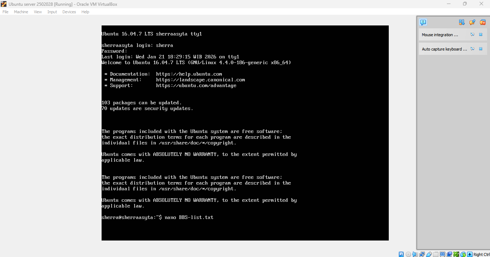
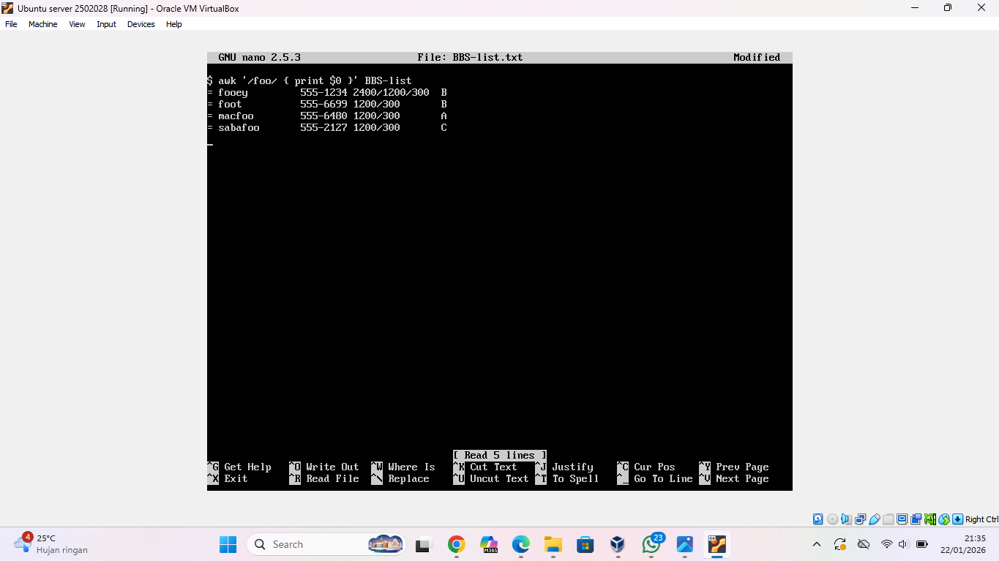
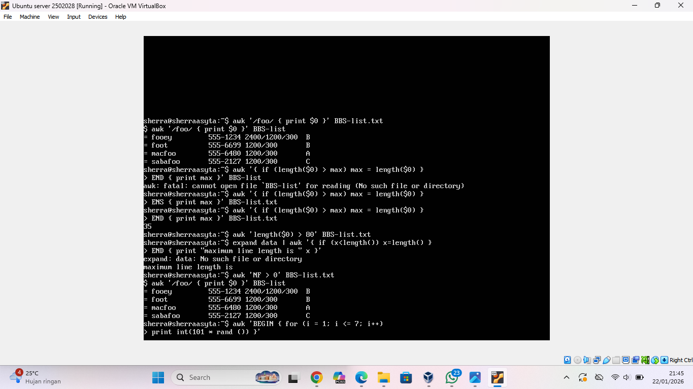
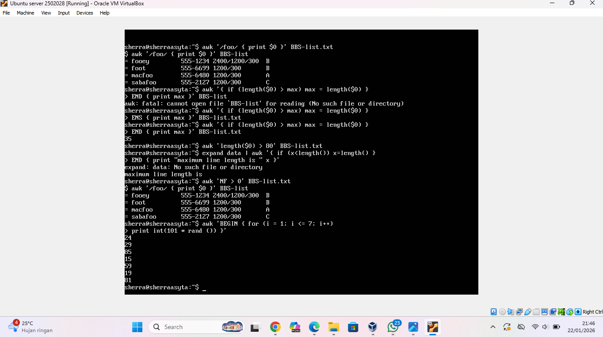
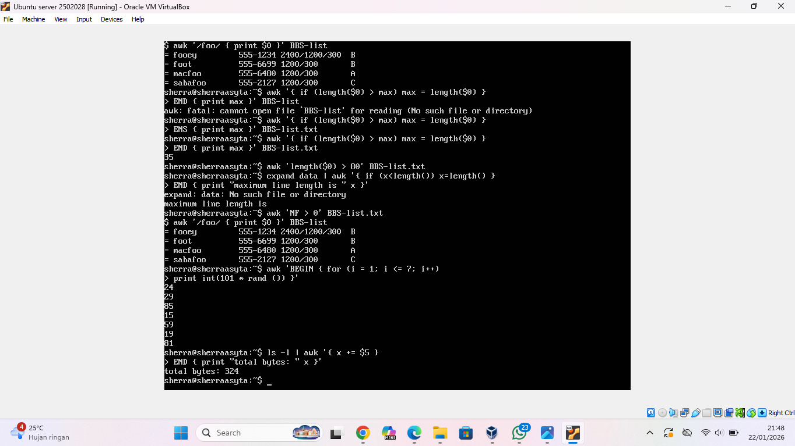
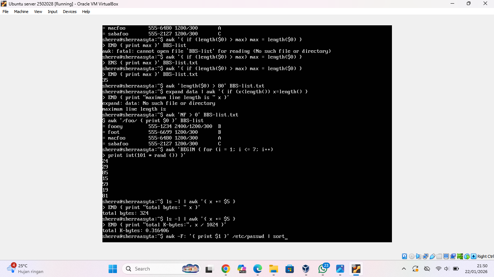
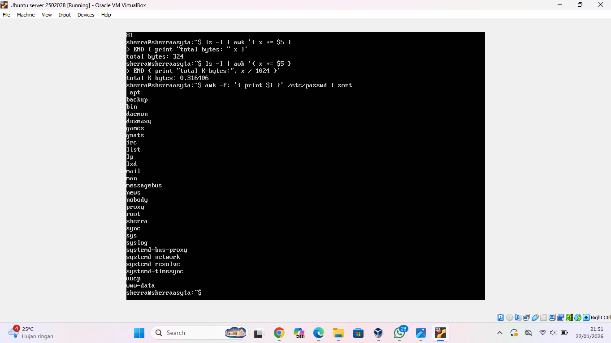
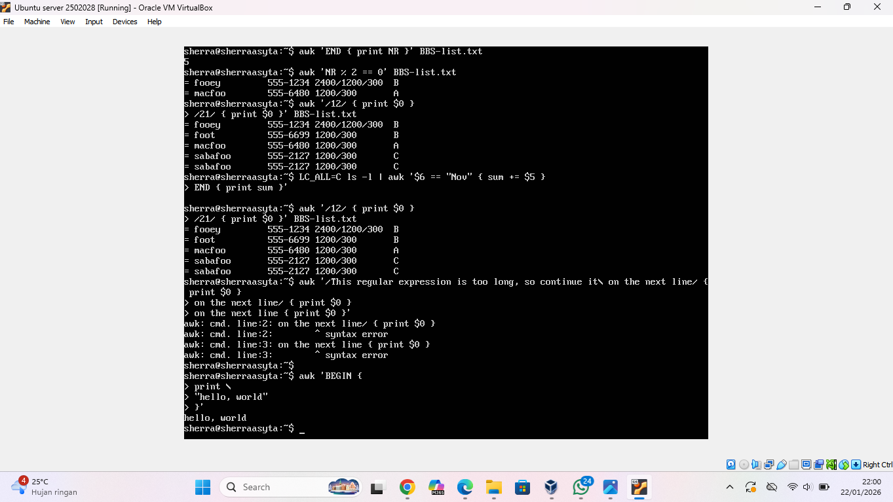

# AWK
## BERKENALAN DENGAN AWK
Awk adalah sebuah bahasa pemrograman seperti pada shell atau C yang memiliki karakteristik yaitu sebagai tool yang cocok untuk filter dan manipulasi file teks. Fungsi dasar awk adalah untuk mencari pola pada file per baris (atau unit teks lain) yang berisi pola tertentu.
Program pada awk berbeda dari program di kebanyakan bahasa lain, karena program awk bersifat “data-driven”; yang mana Anda diminta untuk mendeskripsikan data yang dikehendaki untuk bekerja dan kemudian apa yang akan dilakukan saat data tersebut ditemukan. 
## Percobaan 1: Menjalankan program awk yang pendek
Terdapat beberapa cara untuk menjalankan program awk. Jika programnya pendek, dapat dengan mudah dimasukkan dalam perintah yang menjalankan awk, seperti ini:

  
  
  

## Percobaan 2: Menjalankan program awk yang panjang
Untuk menjalankan program awk yang panjang, maka akan lebih baik untuk menyimpan program tersebut pada sebuah file, kemudian menjalankannya dengan perintah sebagai berikut:

  
  
  
  
  

## DATA FILE PADA AWK
Data file adalah file pada komputer yang menyimpan data untuk digunakan oleh aplikasi komputer atau sistem. Pada umumnya file ini tidak merujuk ke file yang berisi instruksi atau kode yang akan dieksekusi (biasanya disebut file program), atau file yang mendefinisikan operasi atau struktur dari suatu aplikasi atau sistem (termasuk file konfigurasi, file direktori, dll), tetapi khusus untuk informasi yang digunakan sebagai input, atau ditulis sebagai output oleh beberapa program perangkat lunak lainnya. Hal ini sangat berguna ketika mencari kesalahan program.
## Percobaan 1: Contoh stuktur data file

  
  
  

## Percobaan 2: Contoh program sederhana

  
  
  
  
  
  

## Percobaan 3, 4, 5 : Contoh program dengan aturan ganda (two rules) dan yang lebih kompleks, Pernyataan awk dengan perubahan baris

  

